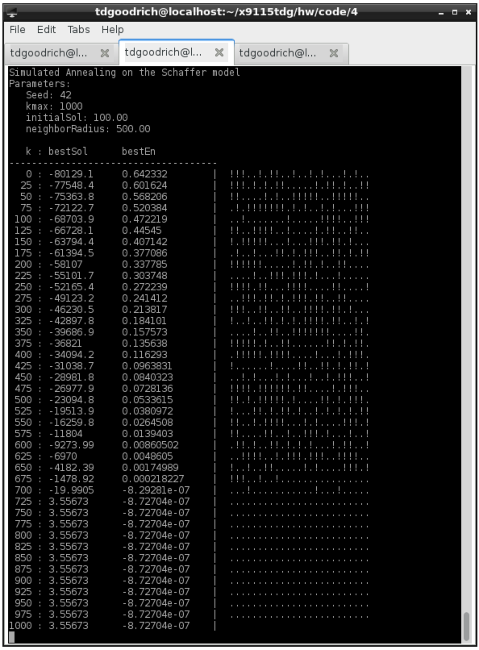

## Solution

### Output

### Some Implementation Notes

1. The neighbor solution is computed by choosing (uniformly at random) another real number within (euclidean) distance _radius_ (a parameter to this algorithm implementation). By default I set _radius=500_
2. I went ahead and seeded the random, in case anyone wants to reproduce. 

### Thoughts/Questions/Places I might have gone wrong

1. I did not use `e > emax` as a condition in the while loop. If this is a minimization problem, why would we stop if we're epsilon away from the sampleMaximum? It's likely that our initial solution is less than the sampleMaximum, in fact. Perhaps I'm misunderstanding something.