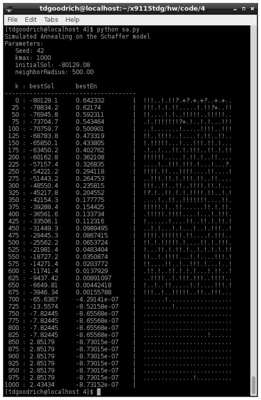

## Solution

### Output

### Questions

1. I did not use `e > emax` as a condition in the while loop, I don't understand how it's useful if we're working on a minimization problem. Wouldn't we want to stop when we were within epsilon of the minimum? What am I missing?
2. In the pseudocode it says to do `ELSE IF P(e, en, k/kmax) > rand()`. However, later on in the document it says `random() > P`. Which way should the inequality go? When I do it the first way I get a lot of jumps to worse solutions, when I do the second way I get absolutely no jumps to worse solutions (but get a much much better final solution).
3. More generally, if I do `random() > P` then the output tells me that all I'm doing is gradient descent (see the output above). Is this bad? I defined the neighborhood function as choosing a value uniformly at random from currentSolution plus or minus a radius value (e.g. 500), perhaps the neighbors are too far out to be reasonable jumps.