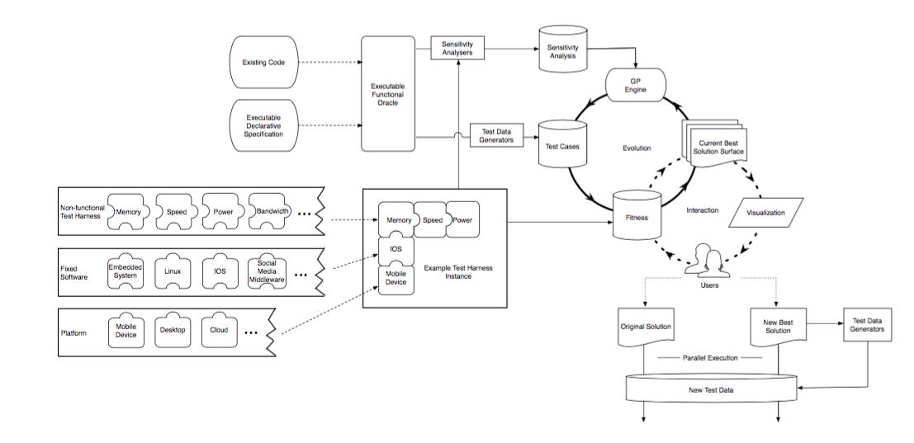
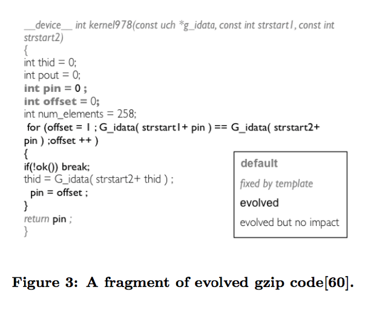

# READ7

## Paper reference:

Mark Harman, William B. Langdon, Yue Jia, David R. White, Andrea Arcuri, and John A. Clark. 2012. The GISMOE challenge: constructing the pareto program surface using genetic programming to find better programs (keynote paper). In Proceedings of the 27th IEEE/ACM International Conference on Automated Software Engineering (ASE 2012). ACM, New York, NY, USA, 1-14.

The paper had 46 citations at time of writing.

## Keywords:

* ii1: **Non-functional properties/requirements**: Non-functional properties/requirements indicate whether a piece of software is behaving correctly, but cannot specify particular behaviors. For example, properties such as speed, size, throughput, power consumption and bandwidth are non-functional, and the software requirements might specify ranges for each property; but the requirement cannot specify exact values.
* ii2: **Functional properties/requirements**: Functional properties/requirements specify exactly what output the software should have.
* ii3: **Search-Based Software Engineering (SBSE)**: Applying metaheuristic search techniques (gradient-ascending, simulated annealing, etc.) to perform typical software engineering tasks (generating software tests, optimizing parameters, etc.).
* ii4: **Pareto surface/frontier**: In multi-objective optimization, the Pareto surface/frontier is the set of all candidate solutions which are not dominated. 

## Notes:

* iii1: Hypothesis/New Result. The authors propose a new way of handling non-functional optimization: Given an input program that satisfies the functional requirements, the GISMOE programming environment will generate candidate program implementations that different in the non-functional trade offs. The software engineer then traverses the resulting Pareto surface, choosing manually between trade offs as he or she sees fit for the project. Whereas before the software engineer had to construct the solution, now he or she is free to choose from a whole assortment of possibilities, also providing the flexibility needed for a project with constantly evolving requirements and spontaneous real-world constraints. As the authors state, “The GISMOE challenge is thus: to create an automated program development environment in which the Pareto program surface is automatically constructed to support dialog with and decision making by the software designer concerning the trade offs present in the solution space of programs for a specific programming problem.”

* iii2: Motivation. The authors spend several pages outline the vast number of motivations. In summary, several different areas have matured to the point where this project/framework is possible. Some of these areas include non-functional measurability, non-functional sensitivity analysis (recall READ4), advances in automated test data generation (recall READ1/2/5), and existing oracles. Tying these tools together, the authors claim to solve problems in the traditional phrasing of these problems. For example, a problem with non-functional requirements is figuring out how to optimize them, especially given multiple objectives (e.g. balancing run time, memory usage, and energy usage). Instead of attacking this problem directly, the authors let the software engineer make these trade off decisions per application. This also solves the problem of the human being out of the loop and trusting a program to “automagically” find the solution to a complex problem. 
* iii3: Informative Visualization. The authors included two images that I found particularly informative. First, the architecture of GISMOE:

This image does an excellent job of conveying the interactions between (generally) machine and user, and (more technically) between optimization and presenting visualizations. The real power of this architecture is presenting results to users that have typically been handled by the optimizers, creating a dialog of results, and this figure convey that interaction. 
The second figure shows what a typical candidate solution looks like:

The image conveys how a piece of code can be optimized at the implementation level, what decisions exist and how they will be evaluated. 

* iii4: Future Work. The last 3 pages of the paper detail open problems related to GISMOE. Two significant ones include:
    1. Measuring non-functional properties as fitness functions. Going back to the problems seen in READ1/2/4, non-functional properties are hard to gauge, represent, and optimize over. GISMOE removes part of the challenge by using the user to optimize the trade offs, but representing these properties is still non-trivial (especially as the amount of automation increases).
    2. Visualization of complex Pareto surfaces. The frontier is easy to visualize with 2 (or even 3) objectives, but what about 5? 50? A 50-dimentional plot cannot be computed, and huge data tables are too much for a user to interpret. One large open problem, then, is figuring out how to represent complex problems to the user. 

## Improvements:

* iv1: Small-scale example. The biggest problem of this paper is that it proposes a whole new framework and provides no low-level details. Granted, these details are not figured out for the whole GISMOE pipeline, but a small-scale example (a proof of concept) could have made the proposed work more concrete. As it is, the proposed work is almost too theoretical to have real flaws yet. 
* iv2: Threats to validity. Building off of the last point, because no real low-level work had been included, the paper did not include a threats to validity section. Instead, these concerns were put in the open problems section (perhaps with a little sugar coating). In effect, the framework seems almost too good to be true. 
* iv3: Concrete datasets. While the software details might not exist yet, the usage case was also left a bit too vague. The examples included a trade off between run time, memory usage, and energy usage; but this is a 3-dimentional problem and so visualization is easy. What would a harder problem look like? What would we want to visualize? Does this data even exist yet or does collecting the data need to be a primary concern already? The paper could use more specifics about the data to answer some of these questions. 

