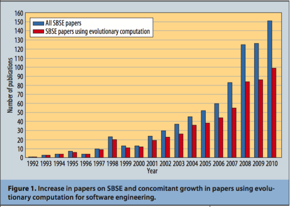

# READ8

## Paper reference:

Mark Harman. 2011. Software Engineering Meets Evolutionary Computation. In Computer. 44, 10 (October 2011), 31-39

The paper had 48 citations at time of writing.

## Keywords:

* ii1: **Evolutionary computation**: Evolutionary computation is a class of algorithms that adopt Darwinian principles (e.g. evolution) to generate waves of candidate solutions. Examples include genetic programming, ant-colony optimization, etc. 
* ii2: **Realistic algorithm**: An informal definition, a realistic algorithm can be expected to run in a reasonable amount of time on a reasonable amount of input; exact orders of magnitude will be domain-specific. For example, in theoretical computer science a polynomial-time algorithm is fast, whereas in engineering applications an algorithm needs linear (or log-linear) run time to be useful. 
* ii3: **Search-Based Software Engineering (SBSE)**: Applying metaheuristic search techniques (gradient-ascending, simulated annealing, etc.) to perform typical software engineering tasks (generating software tests, optimizing parameters, etc.).
* ii4: **Software design**: Software design is the process of formalizing a set of specifications, requirements, and constraints that a proposed piece of software will satisfy. These details can be quantitative or qualitative, and typically evolve as the software matures. 

## Notes:

* iii1: Motivation. Harman makes a strong case for why SBSE is growing in software engineering, citing recent works such as Microsoft using search-based techniques for integrating floating-point computation into its PeX software testing tool, Google using it for multi-objective regression test optimization, and NASA using it for simulation optimization. Quantitatively, the following picture says it all:

* iii2: Tutorial. Harman has a very high-level introduction to evolutionary computation and its many facets in this paper. He motivates it from a software engineering perspective by establishing the role of testing and noting how SBSE can be used for automated bug fixing with genetic programming. He then shares some current open problems, including coevolutionary computation, scalability and how recent work has shown that genetic algorithms are highly parallelizable on GPGPUs, and how techniques need to be introduced that merge the human elements with the automated elements better (for example, see GISMOE in READ7).   
* iii3: Related Work: In this survey, Harmon notes how recent work in SBSE has ranges from requirements to design and testing, to predictive modeling. One big area of recent, he notes, is figuring out how to model the human, qualitative aspects using the objective, quantitative optimization techniques. In particular, fitness functions for non-functional aspects (properties and requirements) is a big hurdle. 
* iii4: Future Work. Harmon notes that SBSE will continue to be one of the premier techniques for testing software, due to its scalability (parallelizability) and continually-improving solution quality. He warns that researchers must not adopt evolutionary algorithms too quickly, though: 
 “We must be wary of the unquestioning adoption of evolutionary algorithms merely because they are popular and widely applicable or because, historically, other researchers have adopted them for SBSE problems; none of these are scientific motivations for adoption. Part of the importance of the second phase of research activity concentrating on characterization and algorithmic complexity analysis lies in the way in which it can help determine the best algorithm for a particular software engineering problem. This will not always be an evolutionary algorithm. For example, there is evidence to suggest that, for branch- adequate test data generation, local search algorithms may be better suited to fast and effective coverage.“
 

## Improvements:

* iv1: Actual scalability. While Harmon mentions that evolutionary algorithms are very parallelizable, he does not give specific examples. Is it parallelizable if the candidates need to communicate often? If not, is sampling the space smartly just good enough, why use evolutionary computation at all?
* iv2: Negative results. While Harmon says that evolutionary computation applies to a diverse array of software engineering tasks, he does not outline specifically which ones they are not applicable to. It would strengthen the reader’s understanding of evolutionary computation if he or she understood the proper application, especially given Harmon’s warning that evolutionary computation is not a jack-of-all-trades.
* iv3: What else? In the figure above, Harmon shows that evolutionary computation is the majority of techniques used for SBSE, but what else is used? Again, the contrast of other tools would help draw out the true power and applicability of evolutionary computation.